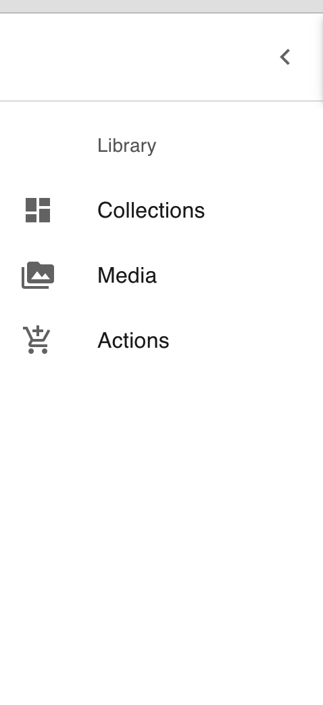
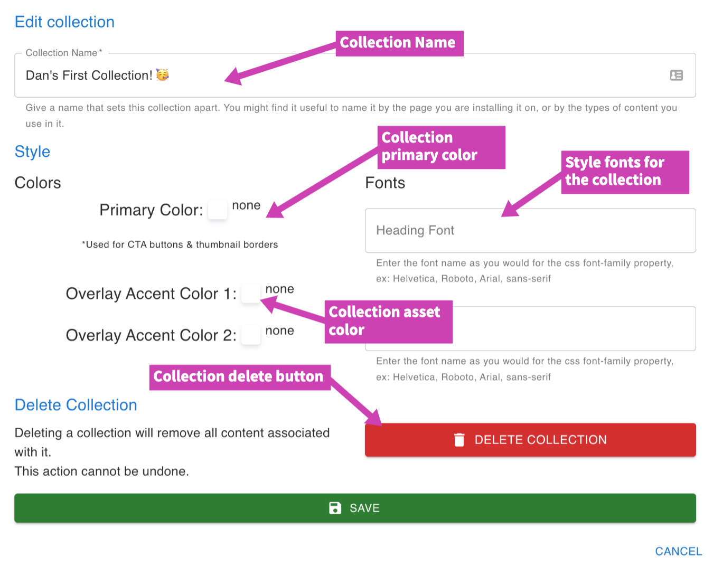

## How to edit a collection
1. Log in to the portal with your admin credential
2. Click on the collection you wish to edit
3. Click on collection settings to open the edit form.
    - You can also delete the collection when the modal is opened, just click the delete button
4. Make your desired changes and click the save button

## Edit collection form

### Annotations Meaning:
**Collection Name**: This is is the name you want to give to the collection, it's not shown on your site but can be used for reference purpose.

**Collection primary color**: This primary color affects the collection when displayed on a site, it's a good idea to use a color that matches your side design.
    - This color affects the thumbnail border, CTA button background color etc

**Style font**: This CSS fonts will be the font designs that will be applied on texts displayed within the collection.

**Delete button**: Use this button to delete a collection.