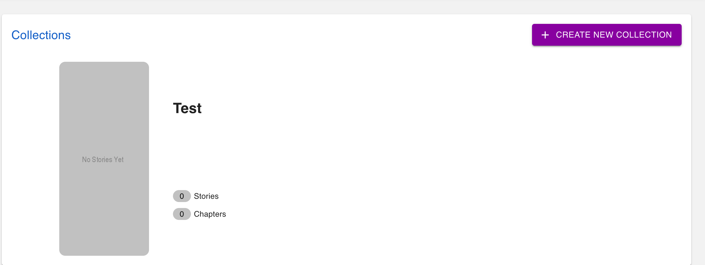
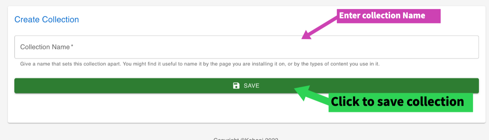

## What is a collection?
A collection is a group of stories, the entire module that shows up on your site is a collection.

    *Collection sample*

## How to create a new collection
1. Log in to te portal with your admin credential
2. You should see the create collection button, similar to the image below.
3. Click on it and enter the collection name then click on the save button

### Create collection form
- Enter the collection name
- Click the save button

